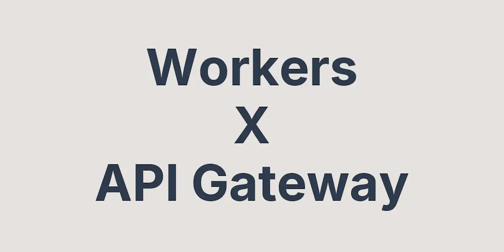

# cf-worker-api-gateway



## Overview

Cloudflare Workers를 이용해서 간단한 API Gateway를 만드는 도구를 소개합니다.

```ts
import { WorkerAPIGateway } from "./router";

const app = new WorkerAPIGateway<Env>({ extended: true });

app.get("/", (req, context) => {
  return Response.json({ message: "Hello World!" });
});

export default app.export();
```

Router, Middleware, Handler 요소들이 내부적으로 어떻게 구성되어서 작동하는지 궁금하신 분들은 [Cloudflare Workers로 Express.js 스타일 API Gateway 프레임워크 개발기](https://blog.day1swhan.com/articles/cf-worker-api-gateway?utm_source=github&utm_medium=referral)에서 보실 수 있습니다.

추가로 기본적인 Workers & KV 사용법과 활용 사례는 아래에서 확인하실 수 있습니다.

- [Cloudflare Workers & KV 이용해서 서버리스 방문자 카운팅 API 만들기 (1/2)](https://blog.day1swhan.com/articles/cloudflare-workers-01?utm_source=github&utm_medium=referral)

- [Cloudflare Workers & KV 이용해서 서버리스 방문자 카운팅 API 만들기 (2/2)](https://blog.day1swhan.com/articles/cloudflare-workers-02?utm_source=github&utm_medium=referral)

## Features

- **미들웨어 지원**: 사용자의 HTTP request, response 요소들을 제어할 수 있습니다.

- [Bindings 지원](https://developers.cloudflare.com/workers/runtime-apis/bindings/): R2, KV Store 같은 Cloudflare Developer Platform 자원들 사용 가능합니다.

- [Context API 지원](https://developers.cloudflare.com/workers/runtime-apis/context/): waitUntil 함수를 이용해서 blocking 없이 응답을 제공하고, Worker 수명을 늘릴 수 있습니다.

## Quick Start

### Installation

프로젝트 clone

```sh
git clone https://github.com/day1swhan/cf-worker-api-gateway.git --depth=1 && \
cd cf-worker-api-gateway
```

필요 모듈 설치, 타입 생성

참고) KV Store 필요 없으신 분들은 `wrangler.jsonc` 파일에서 `kv_namespaces` 부분 지워주시면 됩니다.

```sh
npm install && npm run types
```

### Sample

샘플 코드 확인

```ts
// index.ts
import { WorkerAPIGateway } from "./router";

const app = new WorkerAPIGateway<Env>({ extended: true });

app.get("/", (req, context) => {
  return Response.json({ message: "hello world" });
});

app.get("/user/:id", (req, context) => {
  const { params, query, cookie } = context;
  return Response.json({ params, query, cookie });
});

export default app.export();
```

개발 모드 실행

```sh
npm run dev

Your Worker has access to the following bindings:
Binding                         Resource          Mode
env.WORKERS_KV (123456789)      KV Namespace      local

⎔ Starting local server...
[wrangler:info] Ready on http://localhost:8787
```

API 요청 확인

```sh
curl -i -H 'cookie: uid=98765' \
'http://localhost:8787/user/12345?hello=world'

HTTP/1.1 200 OK
...
{
  "params": { "id": "12345" },
  "query": { "hello": "world" },
  "cookie": { "uid": "98765" }
}
```

## Middleware

미들웨어 함수는 **전역 미들웨어** → **라우터 미들웨어** → **최종 핸들러** 순으로 실행됩니다.

`next` 함수를 이용해서 다음 미들웨어를 호출할 수 있으며, 동기 & 비동기 함수 모두 지원합니다.

`prefix` 기반으로 미들웨어 호출 여부를 제어할 수 있고, prefix 없이 호출된 미들웨어는 전역 미들웨어("/")로 작동합니다.

```ts
import { WorkerAPIGateway, type Middleware } from "./router";

const app = new WorkerAPIGateway<Env>({ ignoreTrailingSlash: true });

const middlewareA: Middleware<Env> = (next) => (req, context) => {
  console.log("middlewareA");
  return next(req, context);
};

const middlewareB: Middleware<Env> = (next) => async (req, context) => {
  console.log("middlewareB");
  return next(req, context);
};

app.use(middlewareA);
app.use("/", middlewareB);

app.get("/", (req, context) => {
  console.log("finalHandler");
  return Response.json({ message: "Hello World" });
});

export default app.export() satisfies ExportedHandler<Env>;
```

```sh
curl -i http://localhost:8787

HTTP/1.1 200 OK
...
{"message":"Hello World"}
```

```sh
# console.log
middlewareA
middlewareB
finalHandler
```

## Error Handling

라우팅 핸들러 오류 발생 시 기본적으로 `500 Internal Server Error` 응답을 반환합니다.

`onError` 함수를 이용하면 사용자 정의 함수로 응답할 수 있습니다.

```ts
app.onError((req, context, err) => {
  console.log("Error: " + (err as Error)?.message || "unknown");
  return Response.json({ message: "Bad Request" }, { status: 400 });
});
```
